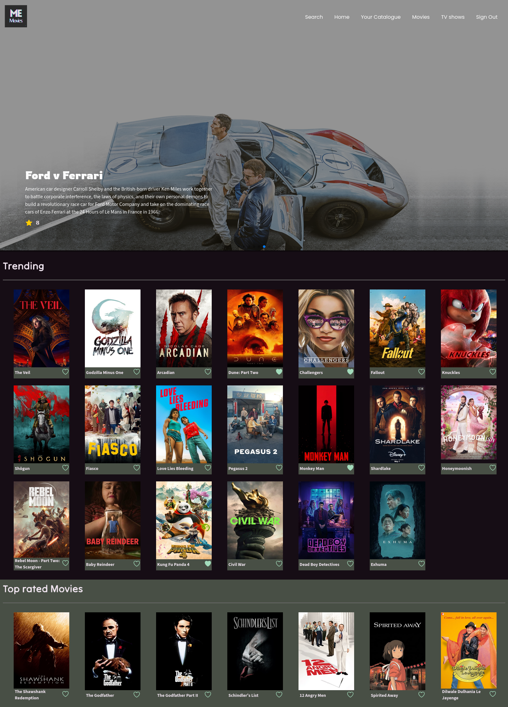

# Me-Movies

[Live Demo Here](https://me-movies.pages.dev/)

## Preview

## Description

Me-movies provides the ultimate personal movie database experience. You can curate your own cinematic universe by: keeping track of your favorite films, creating watchlists for future viewing, and marking movies as watched to track your viewing history.

Whether you're a casual moviegoer or a dedicated cinephile, Me-movies empowers you to organize, discover, and enjoy movies like never before.

## Features

Here are some of the major features of Me-Movies:

- Create a movie and tv show watchlist, favorite list and watched list.
- Watch trailers and preview the summary of movies and tv shows.
- Browse through popular TV shows and movies and filter through them by genre.
- Search for TV shows and movies.
- Have your data saved and synced online upon sign up.

## Technologies Used

Me-Movies has been built using:

- React
- CSS
- Firebase
- TMDB API
- Toastify-JS
- Swiper JS
